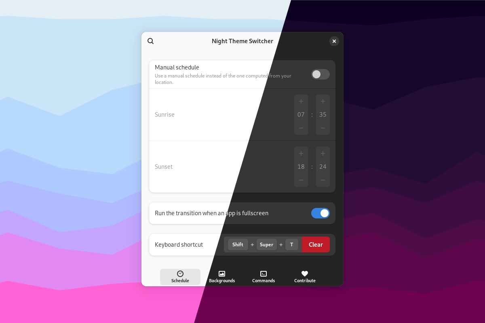

<!--
SPDX-FileCopyrightText: Night Theme Switcher Contributors
SPDX-License-Identifier: CC-BY-SA-4.0
-->

# 夜间主题切换器



在日落和日出时自动切换桌面的浅色和深色配色方案、更换背景并运行自定义命令。

## 图形化安装

访问 [extensions.gnome.org 上的扩展页面](https://extensions.gnome.org/extension/2236/night-theme-switcher/) 并启用该扩展。

## 命令行安装

您需要以下工具：

- `meson`
- `gettext`
- `glib-compile-schemas`
- `glib-compile-resources`

克隆仓库并进入目录：

```bash
git clone https://gitlab.com/rmnvgr/nightthemeswitcher-gnome-shell-extension.git && cd nightthemeswitcher-gnome-shell-extension
```

使用 `meson` 构建并安装：

```bash
# 系统级安装
meson setup builddir && meson install -C builddir

# 用户级安装
meson setup builddir --prefix=~/.local && meson install -C builddir
```

重启 GNOME 会话并启用扩展：

```bash
gnome-extensions enable nightthemeswitcher@romainvigier.fr
```

## 贡献

欢迎您为代码或翻译做出贡献！详见 [CONTRIBUTING.md](./CONTRIBUTING.md)。

## 常见问题

### 某些应用程序没有切换外观

与 GNOME 内置的深色模式一样，本扩展会切换标准的 freedesktop.org 配色方案首选项。较旧的应用程序可能不会遵循此首选项。

可以通过在扩展首选项中运行命令来强制使用特定的 GTK 主题，但请注意这可能会导致应用程序显示异常。更好的做法是请求应用程序开发者支持标准的首选项。

```
gsettings set org.gnome.desktop.interface gtk-theme $THEME_NAME
```

### 在 Ubuntu 上某些功能无法正常工作

不幸的是，Ubuntu 为了实现其某些功能（如强调色）而 heavily 修改了 GNOME 组件。由于其采用非常 hacky 的方式而不是与上游及其他桌面项目合作寻求合适的解决方案，导致与任何处理配色方案和主题的扩展产生冲突，使得扩展体验受损。

由于问题出在 Ubuntu 本身，而且我没有精力和意愿去应对其决策带来的后果，因此直到 Ubuntu 提供标准的 GNOME 环境之前，暂不支持 Ubuntu。

### 我已禁用位置服务但仍想使用我所在位置的日出和日落时间

如果您知道自己的坐标，可以在一个隐藏设置中输入它们，扩展将使用这些坐标来计算日出和日落时间。您可以使用 `gsettings` 命令进行设置：

```
gsettings --schemadir ~/.local/share/gnome-shell/extensions/nightthemeswitcher@romainvigier.fr/schemas/ set org.gnome.shell.extensions.nightthemeswitcher.time location '($LATITUDE,$LONGITUDE)'
```

### 我想使用 `prefer-light` 配色方案或更改白天/夜间使用的配色方案

有两个隐藏设置可以更改白天或夜间使用的配色方案：

```
gsettings --schemadir ~/.local/share/gnome-shell/extensions/nightthemeswitcher@romainvigier.fr/schemas/ set org.gnome.shell.extensions.nightthemeswitcher.color-scheme day $DESIRED_COLORSCHEME
gsettings --schemadir ~/.local/share/gnome-shell/extensions/nightthemeswitcher@romainvigier.fr/schemas/ set org.gnome.shell.extensions.nightthemeswitcher.color-scheme night $DESIRED_COLORSCHEME
```

其中 `$DESIRED_COLORSCHEME` 可以是 `default`、`prefer-dark` 或 `prefer-light` 之一。